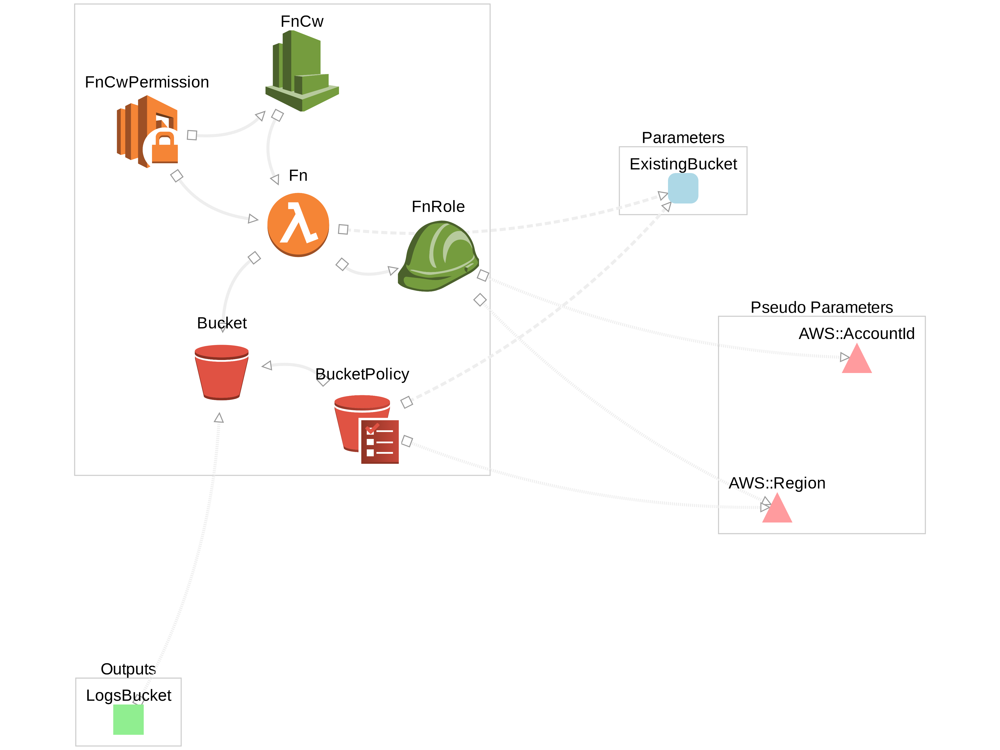

# ecs-task-logs-to-s3

## What
Sends your ECS task logs to Amazon S3. When the tasks stop, a Cloudwatch Event starts and an export task is created. It works for both launch types: Fargate and EC2.

It can create a bucket but you may also specify an existing one as parameter.

## Why
1. Because browsing Clouwatch Logs sucks.
2. Leverage useful S3 features: long term storage, archival, encryption, etc.

## Instructions

If you use [sceptre](https://github.com/cloudreach/sceptre), you can deploy the template in one step with:

`sceptre launch -y main`

Or deploy manually with this button: 

Released under the Simplified BSD Licence.
